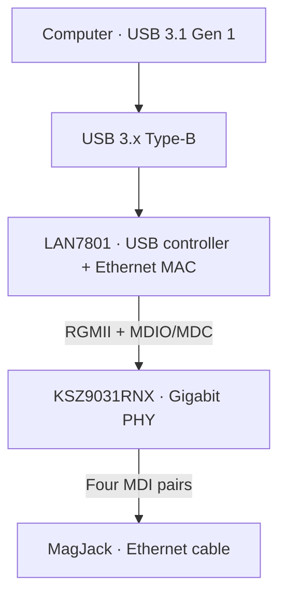

# USB 3.1 Gen 1 to Gigabit Ethernet Adapter

A custom **USB 3.1 Gen 1 (5 Gbit/s) to 10/100/1000BASE-T Ethernet adapter** based on the **Microchip LAN7801** USB Ethernet controller and **KSZ9031RNX** Gigabit Ethernet PHY. This revision uses a **USB 3.x Type-B connector** and a MagJack with integrated Ethernet magnetics.

> **Project status:** Hardware design complete; final design review in progress. The PCB has **not** been fabricated or electrically validated. USB enumeration, Ethernet link speed, throughput, and compliance have not been measured.

## Architecture



The LAN7801 handles the USB device interface and Ethernet MAC; the external KSZ9031RNX handles the copper Ethernet physical layer. RGMII carries data between them, and MDIO/MDC provides PHY management.

## Design highlights

| Area | Implementation / design target |
| --- | --- |
| USB | SuperSpeed TX/RX pairs plus USB 2.0 D+/D− fallback; **90 Ω differential** routing target for USB 3.x |
| MAC to PHY | RGMII data and clocks with source-series termination; MDIO/MDC management |
| Ethernet | Four PHY-to-MagJack MDI pairs; **100 Ω differential** routing target |
| Clock | 25 MHz reference architecture; LAN7801 reference output can clock the PHY when configured for that mode |
| Configuration | External EEPROM for LAN7801 configuration; PHY startup straps |
| Power | Local decoupling and filtered analog rails for the required supply domains |
| PCB | Four layers with two internal ground planes, controlled-impedance routing and ground stitching |

The impedance values above are **design targets**, not measured results. Confirm trace geometry against the selected board manufacturer's actual stack-up before ordering.

## Layout notes

- Keep USB SuperSpeed and Ethernet MDI differential pairs over continuous reference planes; control pair spacing, return paths and layer transitions.
- Route the RGMII TX and RX groups for timing as well as impedance. RGMII is **single-ended**; its 125 MHz clocks at Gigabit rate are distinct from the 25 MHz reference clock.
- Place each RGMII series resistor near its signal driver: LAN7801 for TX signals and KSZ9031RNX for RX signals.
- Check the selected PHY's clock-delay and strap configuration against the MAC settings to avoid duplicating or omitting RGMII clock delay.
- Keep the PHY-to-MagJack MDI paths short. Follow the PHY and magnetics recommendations for center taps, isolation, ESD and chassis/shield handling.
- Verify the LAN7801 25 MHz reference output setting and the PHY clock input path against the schematic during final review. The clock source and reset behavior affect startup.

## Planned bring-up and validation

1. Review the schematic, board rules, stack-up and connector pinout before fabrication.
2. After assembly, inspect power-to-ground resistance; power up with current limiting and verify every supply rail.
3. Check the 25 MHz reference source, any required 125 MHz clock path, resets, EEPROM contents and PHY straps.
4. Connect USB and check device enumeration, driver binding and negotiated USB speed.
5. Connect Ethernet and verify PHY identity, link detection, negotiated speed and duplex.
6. Measure forward and reverse throughput with `iperf3`; inspect link errors and repeat stability testing over time.

Example Linux checks **after a working board and a connected test network are available**:

```bash
lsusb -t                   # Check whether the adapter enumerates at 5000M
ethtool <interface>        # Check link, speed and duplex
iperf3 -c <server-ip> -t 60
iperf3 -c <server-ip> -t 60 -R
```

Replace `<interface>` and `<server-ip>` with the actual network interface and an `iperf3` server on the test network. Record the host, cable, link partner and software setup alongside any measured results.

## References

- [Microchip LAN7801 datasheet](https://ww1.microchip.com/downloads/aemDocuments/documents/UNG/ProductDocuments/DataSheets/LAN7801-Data-Sheet-DS00002123.pdf)
- [Microchip KSZ9031 product documentation](https://www.microchip.com/en-us/product/KSZ9031)

## Author

**Nishant Patil**

No license has been specified for the project files. Add a license file when you decide how others may use the design.


